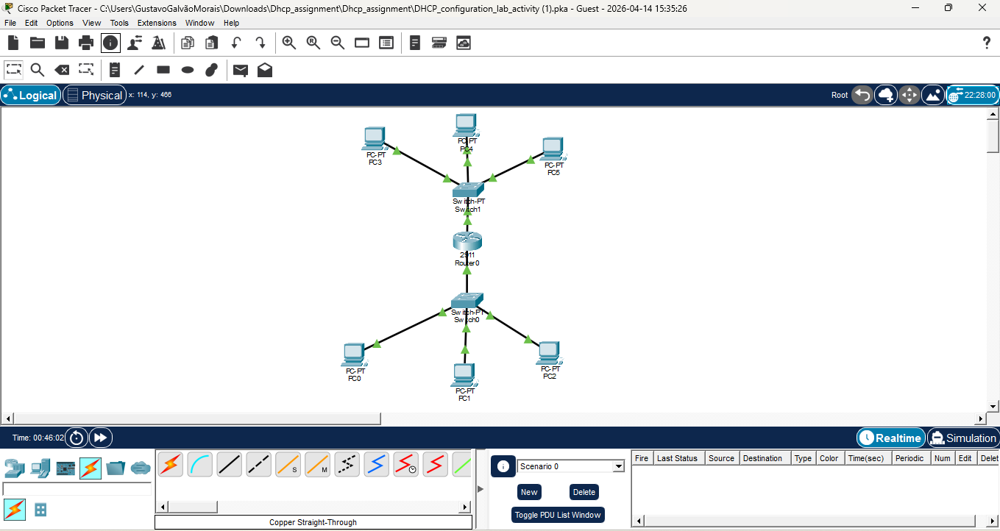

# dhcp-configuration-project



# Cisco DHCP Configuration Lab - Multi-Segment Network

## 📋 Overview
This project demonstrates the configuration of DHCP services on a Cisco router for a corporate network with two distinct segments. The goal is to automate IP address assignment while ensuring infrastructure stability through address exclusion.

## 🛠️ Network Specifications
- **Pool CLASS:** 192.168.10.0/24 (Subnet for Department A)
- **Pool CLASS2:** 192.168.20.0/24 (Subnet for Department B)
- **Shared DNS Server:** 192.168.20.50

## 🔧 Configuration Steps

### 1. IP Address Exclusion
Reserved addresses for Gateways and Static Servers to prevent IP conflicts:
```bash
ip dhcp excluded-address 192.168.10.1 192.168.10.4
ip dhcp excluded-address 192.168.20.1 192.168.20.4

